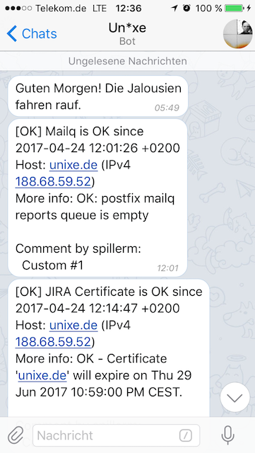
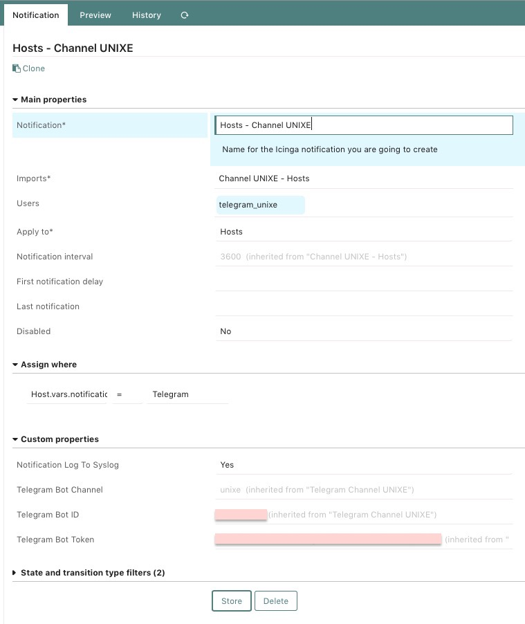

### Notification by Telegram
Send Icinga 2 notification via Telegram



Example Notification Object
---------------------------

```ini
apply Notification "Host by Telegram" to Host {
    command = "Notify Host By Telegram"
    interval = 1h
    assign where host.vars.notification_type == "Telegram"
    users = [ "telegram_unixe" ]
    vars.notification_logtosyslog = true
    vars.telegram_bot = "<YOUR_TELEGRAM_BOT_NAME>"
    vars.telegram_botid = "<YOUR_TELEGRAM_BOT_ID>"
    vars.telegram_bottoken = "<YOUR_TELEGRAM_BOT_TOKEN>"
}
```

Command Definitions
-------------------
```ini
object NotificationCommand "Notify Host By Telegram" {
    import "plugin-notification-command"
    command = [ "/etc/icinga2/scripts/host-by-telegram.sh" ]
    arguments += {
        "-4" = {
            required = true
            value = "$address$"
        }
        "-6" = "$address6$"
        "-b" = "$notification.author$"
        "-c" = "$notification.comment$"
        "-d" = {
            required = true
            value = "$icinga.long_date_time$"
        }
        "-i" = "$icingaweb2url$"
        "-l" = {
            required = true
            value = "$host.name$"
        }
        "-n" = "$host.display_name$"
        "-o" = {
            required = true
            value = "$host.output$"
        }
        "-p" = {
            required = true
            value = "$telegram_bot$"
        }
        "-q" = {
            required = true
            value = "$telegram_botid$"
        }
        "-r" = {
            required = true
            value = "$telegram_bottoken$"
        }
        "-s" = {
            required = true
            value = "$host.state$"
        }
        "-t" = {
            required = true
            value = "$notification.type$"
        }
        "-v" = "$notification_logtosyslog$"
    }
}
```

```ini
object NotificationCommand "Notify Service By Telegram" {
    import "plugin-notification-command"
    command = [ "/etc/icinga2/scripts/service-by-telegram.sh" ]
    arguments += {
        "-4" = {
            required = true
            value = "$address$"
        }
        "-6" = "$address6$"
        "-b" = "$notification.author$"
        "-c" = "$notification.comment$"
        "-d" = {
            required = true
            value = "$icinga.long_date_time$"
        }
        "-e" = {
            required = true
            value = "$service.name$"
        }
        "-i" = "$icingaweb2url$"
        "-l" = {
            required = true
            value = "$host.name$"
        }
        "-n" = "$host.display_name$"
        "-o" = {
            required = true
            value = "$service.output$"
        }
        "-p" = {
            required = true
            value = "$telegram_bot$"
        }
        "-q" = {
            required = true
            value = "$telegram_botid$"
        }
        "-r" = {
            required = true
            value = "$telegram_bottoken$"
        }
        "-s" = {
            required = true
            value = "$service.state$"
        }
        "-t" = {
            required = true
            value = "$notification.type$"
        }
        "-u" = {
            required = true
            value = "$service.display_name$"
        }
        "-v" = "$notification_logtosyslog$"
    }
}
```


